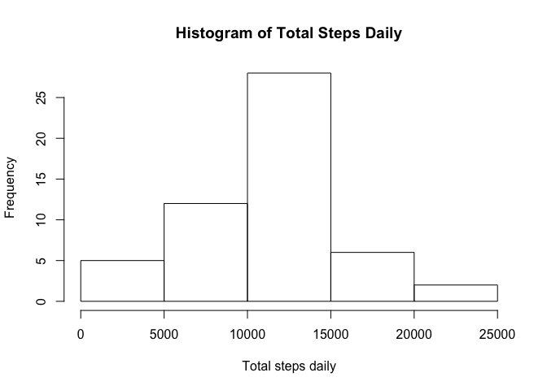
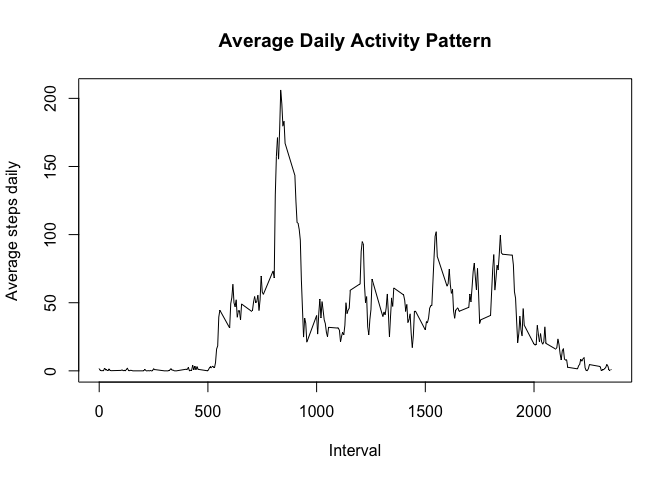
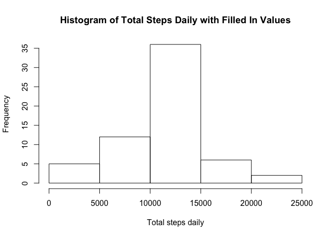
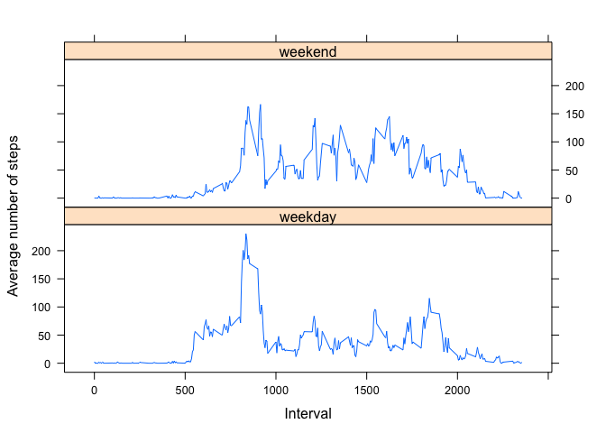

## Loading and preprocessing the data
Loading the data from a zipped file, and creating a separate data frame with no NA values. We will be using this data frame to process necessary calculations and aggregations in the next few items.

```r
data <- read.csv(unz("activity.zip","activity.csv"))
cleandata <- data[complete.cases(data),]
str(cleandata)
```

```
## 'data.frame':	15264 obs. of  3 variables:
##  $ steps   : int  0 0 0 0 0 0 0 0 0 0 ...
##  $ date    : Factor w/ 61 levels "2012-10-01","2012-10-02",..: 2 2 2 2 2 2 2 2 2 2 ...
##  $ interval: int  0 5 10 15 20 25 30 35 40 45 ...
```

## What is mean total number of steps taken per day?
Creating histogram of total steps taken daily.

```r
d2 <- aggregate(steps ~ date, cleandata, sum)
hist(d2$steps, xlab = "Total steps daily", main = "Histogram of Total Steps Daily")
```

<!-- -->

The code block below will calculate the mean and median of total number of steps daily.

```r
ave <- format(round(mean(d2$steps)))
med <- median(d2$steps)
```
The calculated mean steps daily is **10766**, and the calculated median steps daily is **10765**.

## What is the average daily activity pattern?
Creating a time series plot of the average number of steps daily per 5-minute interval, and getting the interval correspoding to the highest value.

```r
d3 <- aggregate(steps ~ interval, cleandata, mean)
maxint <- d3$interval[which.max(d3$steps)]
plot(d3$interval, d3$steps, type='l', main = 'Average Daily Activity Pattern', xlab = 'Interval', ylab = 'Average steps daily')
```

<!-- -->

The interval with the highest average number of steps in a day is **interval 835**.

## Imputing missing values
The following code chunk will calculate the number of rows with missing values.

```r
narows <- sum(rowSums(is.na(data)))
```
In total, there are **2304 rows** with missing values. 

We will then create a new data frame where all NA values will be replaced with the average value on a certain factor. We will use the mean steps per 5-minute interval in filling in the missing values. Note that this data has already been calculated previously, and was stored in data frame *d3*.

```r
data_filled <- data
for (i in 1:nrow(data_filled)){
  if (is.na(data_filled$steps[i])){
    inter_val = data_filled$interval[i]
    data_filled$steps[i] <- d3$steps[which(d3$interval == inter_val)]
  }
}
str(data_filled)
```

```
## 'data.frame':	17568 obs. of  3 variables:
##  $ steps   : num  1.717 0.3396 0.1321 0.1509 0.0755 ...
##  $ date    : Factor w/ 61 levels "2012-10-01","2012-10-02",..: 1 1 1 1 1 1 1 1 1 1 ...
##  $ interval: int  0 5 10 15 20 25 30 35 40 45 ...
```
The histogram of the total steps taken daily is generated data frame is created through the following code block.

```r
d4 <- aggregate(steps ~ date, data_filled, sum)
hist(d4$steps, xlab = "Total steps daily", main = "Histogram of Total Steps Daily with Filled In Values")
```

<!-- -->

Calculations for the mean and median steps daily are included in this block.

```r
ave2 <- format(round(mean(d4$steps)))
med2 <- format(round(median(d4$steps)))
```
The new mean steps daily is **10766**, and the new median steps daily is **10766**. The original mean and median values are **10766** and **10765**, which show that there is only a slight difference in the median when we filled in missing values with the average steps per interval. The mean stays the same.

## Are there differences in activity patterns between weekdays and weekends?
Creating a new factor value with levels *weekend* and *weekday*.

```r
data_filled$day <- weekdays(as.Date(data_filled$date))
data_filled$day[data_filled$day %in% c('Saturday','Sunday')] <- 'weekend'
data_filled$day[data_filled$day != 'weekend'] <- 'weekday'
data_filled$day <- as.factor(data_filled$day)
str(data_filled)
```

```
## 'data.frame':	17568 obs. of  4 variables:
##  $ steps   : num  1.717 0.3396 0.1321 0.1509 0.0755 ...
##  $ date    : Factor w/ 61 levels "2012-10-01","2012-10-02",..: 1 1 1 1 1 1 1 1 1 1 ...
##  $ interval: int  0 5 10 15 20 25 30 35 40 45 ...
##  $ day     : Factor w/ 2 levels "weekday","weekend": 1 1 1 1 1 1 1 1 1 1 ...
```
Aggregating mean steps by *interval* and *day* factor, then plotting the activity patterns during *weekend* and *weekdays*.

```r
library(lattice)
d5 <- aggregate(steps ~ interval + day, data_filled, mean)
xyplot(steps ~ interval | day, d5, type = "l", layout = c(1,2), xlab = "Interval", ylab = "Average number of steps")
```

<!-- -->
The number of steps per interval during weekdays seems to be less skewed compared to that of the weekend; the average steps taken peaked at around the 800th interval on weekends and then drastically decreased afterwards, while we see many peaks throughout the day during weekdays.
